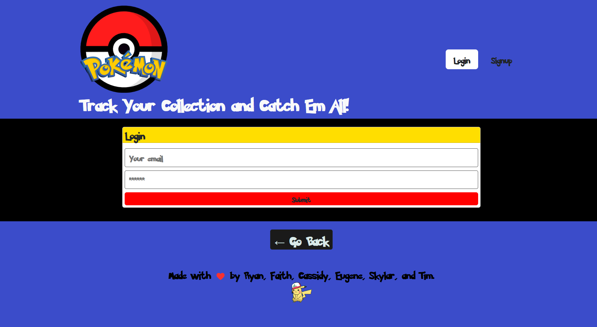
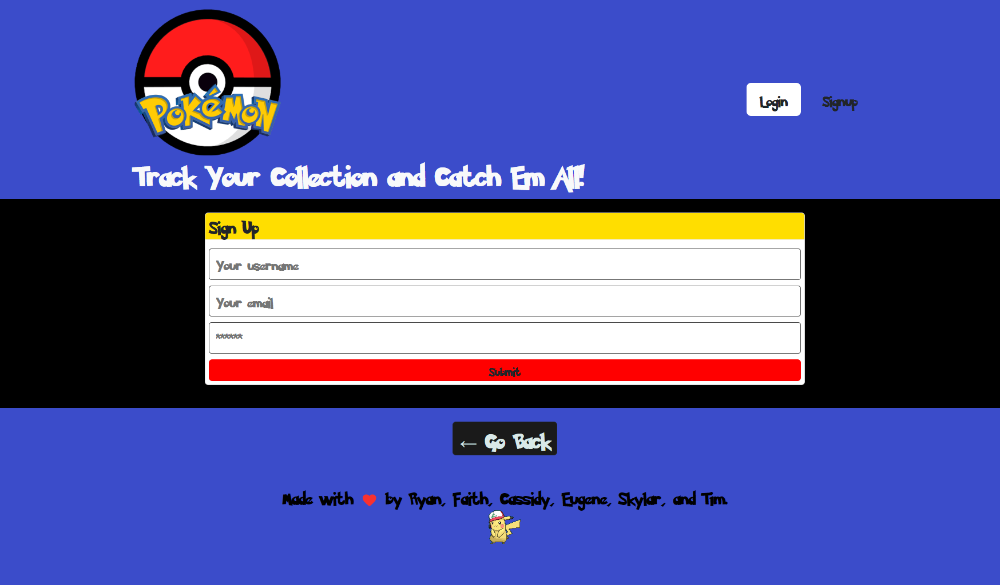

# Poketracker App
---

## Description

---

We created an application that uses GraphQL API built with Apollo Server. The app was built using the MERN stack with a React front end, MongoDB database, and Node.js/Express.js server. The application  gives the user the ability to catalog a collectionof favorite Pokemon characters by display a group of available characters and adding them to a personal list.


## Project Requirement 
--- 

✅ Use React for the front end.

✅ Use GraphQL with a Node.js and Express.js server.

✅ Use MongoDB and the Mongoose ODM for the database.

✅Use queries and mutations for retrieving, adding, updating, and deleting data.

✅Be deployed using Heroku (with data).

✅ Have a polished UI.

✅Be responsive.

✅ Be interactive (i.e., accept and respond to user input).

✅ Include authentication (JWT).

✅ Protect sensitive API key information on the server.

✅Have a clean repository that meets quality coding standards (file structure, naming conventions, best practices for class and id naming conventions, indentation, high-quality comments, etc.).

✅Have a high-quality README (with unique name, description, technologies used, screenshot, and link to deployed application).

## Installation 
---

```
apollow/Client
apollow/react-hooks
bootstraps
graphql
jwt-decode
react
```

## Usage 
---

Once all the packages have been installed, run the following commend in the terminal:
```
npm run seed
npm run develop

```


## User Story
---

```
✔️ As a pokemon collector, 
✔️ I WANT a webpage that display the top pokemon cards 
✔️ SO THAT I can sort through and select my favorite pokemon cards
✔️ I WANT to be able to click on my favorite pokemon card, 
✔️ SO THAT I can add it to my profile collection 
✔️ I WANT to have the abilty to edit the pokemon,
✔️ SO THAT I can remove it from my profile 

```
## Acceptance Criteria 
---
```
✔️ WHEN I open the webpage I am presented with a polished UI with the ability to login or create an account
✔️ WHEN I choose to create an account, I am prompted to enter a name, email and password
✔️ WHEN I create an account, I am presented with pokemon cards displaying the name, number of the pokemon, and the option to have it shiny or not
✔️ WHEN I sort through all the available pokemon cards, I have the ability to select my favorite one
✔️ WHEN I select my favorite pokemon card I am able to add it to my profile
✔️ WHEN I view my profile, I am able to see all my favorite selected pokemon cards
✔️ WHEN I click delete on any of the collection in my profile, the pokemon card is able to be removed from my profile 
✔️ WHEN I click log out, then I am logged out of my profile and the cards are no longer displaying
✔️ WHEN I click log back in, I am able to go to my profile to view my previous selected pokemon cards


```

## Link To Deploy Site
---
https://poketrakerapp.herokuapp.com/
## Mock-Up
---
* The user is presentated with the login page



* The user is presentated with the sign up page




## Authors
  ☑️Cassidy Youngreen 
  ☑️Eugene Isingizwe
  ☑️Faith Vaz
  ☑️Ryan Youngreen
  ☑️Tim Hanna
  ☑️Skylar Martin 

## License
MIT License

Copyright (c) 2022 Eugene


